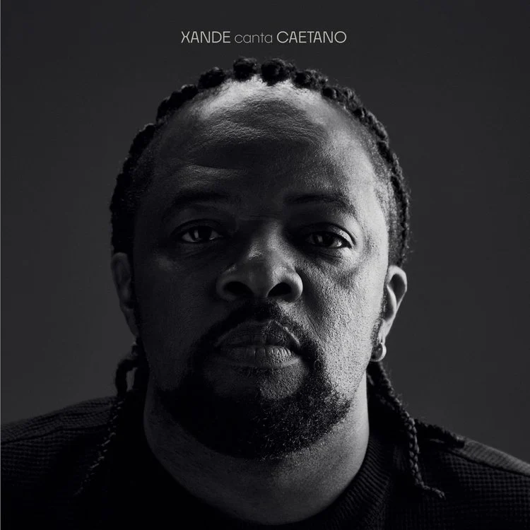

# Nicoshouqi 🐀 > 🐘

## 🎲 A cli doshouqi game

## 📝 Description

Nicoshouqi is a command-line game developed in Swift. It is based on the chinese board game [doshouqi](link-to-smth??). It was made during a Swift class designed by professor _Marc Chevaldonné_. The original content for this project can be found here: [source](https://codefirst.iut.uca.fr/git/mchSamples_Apple/DouShouQi) 

## 🚀 Installation

To install the game you can try the following: 

```sh
git clone https://codefirst.iut.uca.fr/git/nicolas.franco/nicoshouqi.git
cd cli-doshou
swift build
```

## 🎮 Play 
To play the game, run the following command in your terminal:
```sh
swift run
```

## 🧪 Testing
You can run tests if you like, use :
```sh
swift test
```

## :memo: Todo list
* tostring pour board pas de attribut classique
* a revoir guard vs if when to use one rather than the other

### TP3 - TESTS checklist
* createBoard
* checkBoard
* getNextPlayer
* getMoves1
* getMoves2
* isMoveValid1
* isMoveValid2

__Remaining:__  
* isGameOver
* playedMove

* set pour verifier inserted
* verif pieces not allowed: loup chien
* toggle method pour getNextPlayer ?
* Elephant corriger
* boucle de jeux
---
Suggestions to listen too, while writting some tutorials or courses... 

<table>
    <tr>
        <td>
            
        </td>
        <td>
            <div>
                <p><b>Xande Canta Caetano</b></p>
                <p><i>Xande de Pilares</i> (2023)</p>
            </div>
        </td>
    </tr>
</table>


